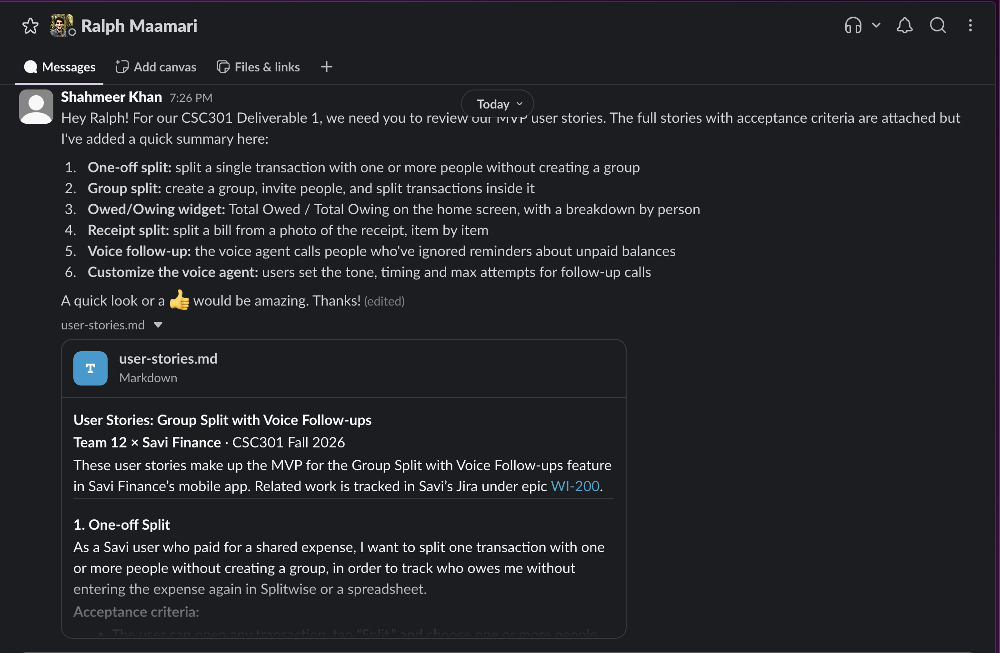
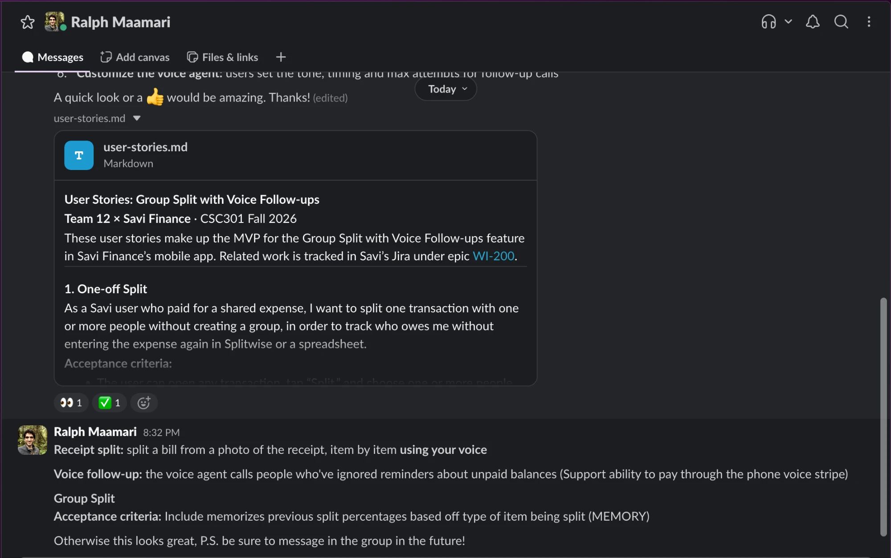
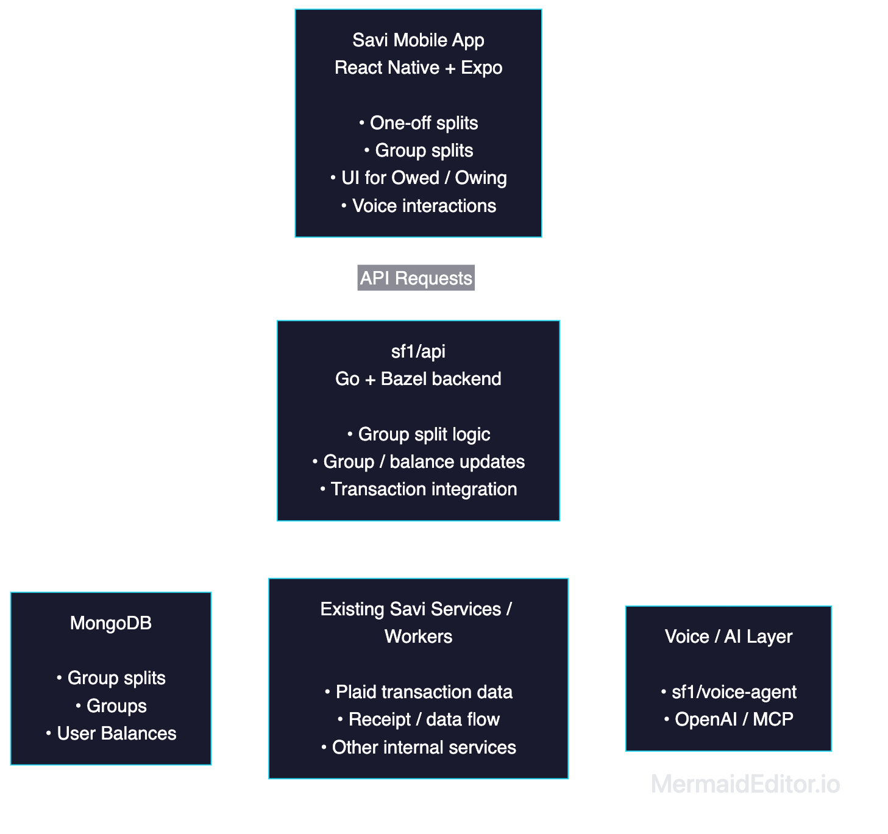
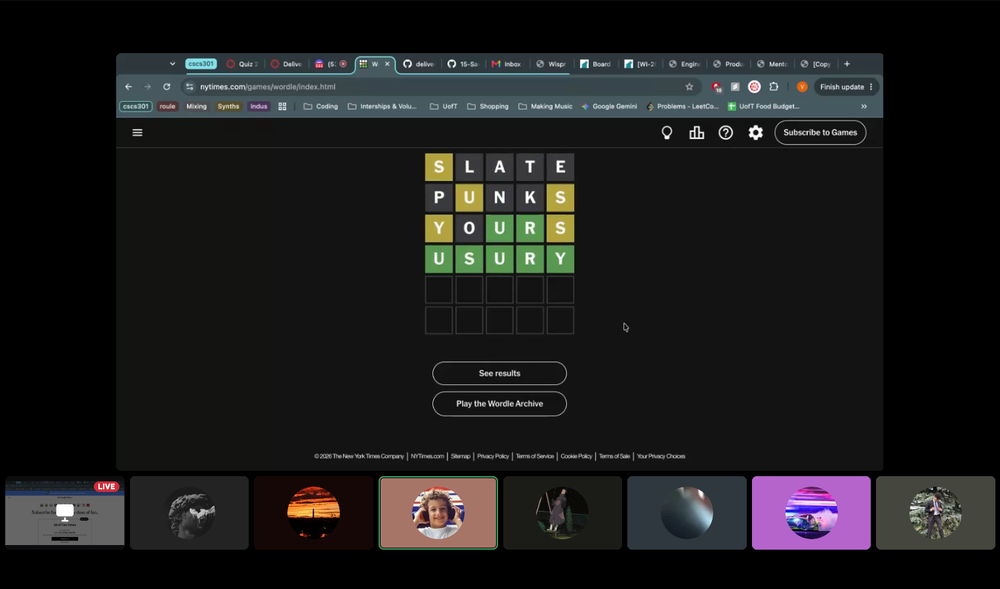

# YOUR PRODUCT/TEAM NAME
> _Note:_ This document will evolve throughout your project. You commit regularly to this file while working on the project (especially edits/additions/deletions to the _Highlights_ section). 
 > **This document will serve as a master plan between your team, your partner and your TA.**

## Product Details
 
#### Q1: What is the product?

 > Short (1 - 2 min' read)
 * Start with a single sentence, high-level description of the product.
 * Be clear - Describe the problem you are solving in simple terms.
 * Specify if you have a partner, who they are (role/title), and the organization information.
 * Be concrete. For example:
    * What are you planning to build? Is it a website, mobile app, browser extension, command-line app, etc.?      
    * When describing the problem/need, give concrete examples of common use cases.
    * Assume the reader knows nothing about the partner or the problem domain and provide the necessary context. 
 * Focus on *what* your product does, and avoid discussing *how* you're going to implement it.      
   For example: This is not the time or the place to talk about which programming language and/or framework you are planning to use.
 * **Feel free (and very much encouraged) to include useful diagrams, mock-ups and/or links**.

#### Q2: Who are your target users?

  > Short (1 - 2 min' read max)
 * Be specific (e.g. a 'a third-year university student taking CSC301 and studying Computer Science' and not 'a student')
 * **Feel free to use personas. You can create your personas as part of this Markdown file, or add a link to an external site (for example, [Xtensio](https://xtensio.com/user-persona/)).**

#### Q3: Why would your users choose your product? What are they using today to solve their problem/need?

> Short (1 - 2 min' read max)
 * We want you to "connect the dots" for us - Why does your product (as described in your answer to Q1) fits the needs of your users (as described in your answer to Q2)?
 * Explain the benefits of your product explicitly & clearly. For example:
    * Save users time (how and how much?)
    * Allow users to discover new information (which information? And, why couldn't they discover it before?)
    * Provide users with more accurate and/or informative data (what kind of data? Why is it useful to them?)
    * Does this application exist in another form? If so, how does your differ and provide value to the users?
    * How does this align with your partner's organization's values/mission/mandate?

#### Q4: What are the user stories that make up the Minumum Viable Product (MVP)?

Full user stories and acceptance criteria are also in [user-stories.md](./user-stories.md). Related work is tracked in Savi's Jira under [WI-200](https://savifinance.atlassian.net/browse/WI-200).

**1. One-off Split**

As a Savi user who paid for a shared expense, I want to split one transaction with one or more people without creating a group, in order to track who owes me without entering the expense again in Splitwise or a spreadsheet.

Acceptance criteria:
 * The user can open any transaction, tap "Split," and choose one or more people.
 * The split is even by default, and the user can switch to dollar amounts or percentages.
 * If the splits don't add up to the transaction total (more than $1 off), an error is shown.
 * The user's budget counts only their share, e.g. $25 of a $100 dinner split four ways.
 * Each person's balance with the user updates right away.

**2. Group split**

As a roommate who shares rent and utilities, I want to create a group and split transactions inside it, in order to manage shared costs that repeat in one place.

Acceptance criteria:
 * The user can create a group with a unique name and invite people by email or invite link.
 * Invitees get a notification they can accept or reject. They show as "pending" until they accept.
 * Any member can add a transaction to the group. It's split evenly across members by default, and amounts can be adjusted.
 * The group page shows each person's net balance and a history of all changes.
 * Savi remembers the split percentages used for each type of item in the group (e.g. rent, utilities, groceries) and suggests them the next time that type of item is split. The user can change them before confirming.

**3. Owed/Owing widget**

As a Savi user, I want to see my Total Owed and Total Owing on my home screen, in order to know where I stand with friends at a glance.

Acceptance criteria:
 * The home screen shows Total Owed to me and Total I Owe, across all one-off and group splits.
 * Tapping a total shows a breakdown by person and by group.
 * Either person can mark a balance as resolved, and can undo it.
 * Resolved balances drop out of the totals but stay in the history.

**4. Receipt Split**

As a user who paid for a group meal, I want to split the bill from a photo of the receipt and assign items to each person using my voice, in order to split the bill fairly when people order different things.

Acceptance criteria:
 * The user can take or upload a photo of a receipt, and it's broken into line items plus tax and tip.
 * The user can fix any items that were read incorrectly.
 * Each item can be assigned to one or more people. Shared items are split evenly.
 * The user can assign items by speaking, e.g. "Sam had the burger, Alex and I shared the nachos," and the assignments appear on screen to confirm or fix.
 * Tax and tip are split based on what each person ordered.
 * The user sees what each person owes before confirming.

**5. Voice follow-up**

As a user who is owed money, I want to have Savi's voice agent call friends who haven't paid after they've ignored their reminders, in order to get paid back without having an awkward conversation.

Acceptance criteria:
 * Voice follow-up is off by default, and the user turns it on per split or group.
 * A call only goes out after push/email reminders go unanswered for a set time.
 * The agent says it's automated and who it's calling for.
 * The agent handles "I already paid," "I'll pay on [date]," "I dispute this," and "don't call me again."
 * Anyone who says "don't call me" is never called again.
 * The person being called can pay the balance during the call through Stripe. A successful payment marks the balance as paid automatically.
 * The call result is shown on the balance. Apart from payments made through Stripe on the call, a balance is never marked paid unless the user confirms it.

**6. Customize the voice agent**

As a user who is owed money, I want to control how the voice agent follows up, in order to make the calls fit my relationship with the person.

Acceptance criteria:
 * The user can set the agent's tone (e.g. friendly or firm), when calls start, and the maximum number of attempts.
 * Settings can be applied to a single split or to a whole group.
 * The user can see a log of past calls and how each one ended (promised a date, disputed, paid, opted out).

User stories sent to Ralph Maamari (Founder, Savi Finance) for review on October 2, 2026:

  

Ralph reviewed the stories the same day and approved them with three changes, which are included above: voice input for receipt splits, paying through Stripe during a voice follow-up call, and remembering split percentages by item type in groups.

  

#### Q5: Have you decided on how you will build it? Share what you know now or tell us the options you are considering.

We haven't finalized every implementation detail yet, but we'll be building within Savi's existing monorepo and architecture.

The Savi mobile application is built in TypeScript using React Native and Expo. Backend services are primarily written in Go and built with Bazel, with `sf1/api` serving as the main JSON-RPC API used by their mobile app. MongoDB is Savi's primary database.

Our current plan is to add the Group Split UI to the existing mobile app and connect it to new or existing backend API functionality for creating groups, splitting expenses, and tracking balances. This feature will also integrate with existing Savi systems like transaction data, receipt-related functionality, and potentially the existing voice-agent service for voice interactions (if time permits).

Below is the high level architecture diagram our group agreed upon:

  

For deployment, we are expected to push to prod at least 3 times throughout the semester. Our deployments will follow Savi's existing infrastructure and CI/CD process, which uses GitHub Actions and deployment scripts within the monorepo. Mobile builds are managed with Expo/EAS, and backend services are deployed through Savi's existing infrastructure. A lot of these tools and technologies are foreign to us, so we'll make sure to research them thoroughly before pushing/deploying our code.

As for Savi's third party apps and APIs, we've learned that their existing integrations include Plaid for banking data, OpenAI for AI-powered features, and AWS for services such as S3. The exact APIs and services needed for our feature will be finalized soon during technical design.

----
## Intellectual Property Confidentiality Agreement 
> Note this section is **not marked** but must be completed briefly if you have a partner. If you have any questions, please ask on Piazza.
>  
**By default, you own any work that you do as part of your coursework.** However, some partners may want you to keep the project confidential after the course is complete. As part of your first deliverable, you should discuss and agree upon an option with your partner. Examples include:
1. You can share the software and the code freely with anyone with or without a license, regardless of domain, for any use.
2. You can upload the code to GitHub or other similar publicly available domains.
3. You will only share the code under an open-source license with the partner but agree to not distribute it in any way to any other entity or individual. 
4. You will share the code under an open-source license and distribute it as you wish but only the partner can access the system deployed during the course.
5. You will only reference the work you did in your resume, interviews, etc. You agree to not share the code or software in any capacity with anyone unless your partner has agreed to it.

**Your partner cannot ask you to sign any legal agreements or documents pertaining to non-disclosure, confidentiality, IP ownership, etc.**

Briefly describe which option you have agreed to.

Our agreement is a mix of a few of the options. Each one of us is only allowed to show the code that we have personally contributed to the codebase to external sources (like interviews, etc.). We are allowed to take videos, screenshots, demos of the final product to add to our portfolio and show to external sources.

----

## Teamwork Details

#### Q6: Have you met with your team?

Several members of our team have known one another since our first year at UofT, while others became acquianted through mutual friends. Our first team-building meeting was held online, where we bonded by playing some NYT and puzzle games together, in addition to discussing the project's architecture and technical design.

  

Team Fun Facts:
 * David and Shahmeer originally met while working as interns at Shopify this summer in Toronto.
 * Many of us enjoy going to concerts, especially Pranay and Sambhav, who have been to 5+ concerts this summer together.
 * We all LOVE cats except Pranay who is scared of them.

#### Q7: What are the roles & responsibilities on the team?

partner liaison is Sumedh

mobile is Praneeth, Pranay

backend is David, Shaun

AI/LLM Integration is sumedh, Sambhav, Shahmeer

Describe the different roles on the team and the responsibilities associated with each role (e.g., frontend, database). 
 * Roles should reflect the structure of your team and be appropriate for your project. One person may have multiple roles.  
 * Add role(s) to your Team-[Team_Number]-[Team_Name].csv file on the main folder.
 * At least one person must be identified as the dedicated partner liaison. They need to have great organization and communication skills.
 * Everyone must contribute to code. Students who don't contribute to code enough will receive a lower mark at the end of the term.

List each team member and:
 * A description of their role(s) and responsibilities including the components they'll work on and non-software related work
 * Why did you choose them to take that role? Specify if they are interested in learning that part, experienced in it, or any other reasons. Do no make things up. This part is not graded but may be reviewed later.

#### Q8: How will you work as a team?

 * **Weekly team meeting:** We meet online every Tuesday at 5:30pm to review Jira progress, assign or rebalance work, discuss technical decisions, and identify blockers. We may schedule additional online working sessions or move the meeting when a deadline requires it.
 * **Weekly partner meeting:** We meet with Ralph from Savi Finance online every Wednesday from 6:00pm to 6:20pm to discuss product direction and technical blockers, ask partner-specific questions, and receive feedback on our progress. Before D1, we met with Ralph on September 23 and September 30; the minutes are recorded in `/minutes`.
 * **Weekly TA meeting:** We meet with our TA online every Thursday from 7:00pm to 7:30pm to clarify course deliverable expectations, receive feedback on our process, and raise issues that cannot be resolved internally.
 * **Day-to-day collaboration:** We coordinate in Discord, track work in Jira, and use GitHub pull requests for code review. Each pull request is reviewed by at least one teammate before it is merged. We record meeting decisions and action items in the meeting minutes or the relevant Jira ticket.
  
#### Q9: How will you organize your team?

We use the tools provided by our partner, Savi Finance, as well as one of our own:
 * **Jira (Savi Finance):** our task board. Every piece of work is a ticket with one owner.
 * **Confluence (Savi Finance):** documentation, such as the architecture, technical designs and end-to-end user flows.
 * **Slack (Savi Finance):** questions and day-to-day communication with our partner.
 * **GitHub:** code, pull requests, documentation, and meeting minutes under `/minutes`.
 * **Discord (team only):** a separate server for communication within the team.

Our partner works in Jira, Confluence and Slack directly, and can see our code and notes on GitHub.

**Prioritization:** We prioritize work required for the MVP according to our partner's delivery plan.

**Assignment:** During our weekly team meeting, we assign tickets to team members based on their role and responsibilities. Each ticket has one owner. As team members complete their assigned work, they may take on unassigned tickets within their area of responsibility.

**Status:** Tickets move through the following stages: To Do, In Progress, In Review, and Done. The Jira board is the source of truth for ticket ownership and progress.

#### Q10: What are the rules regarding how your team works?

**Communications:**
 * Team: Discord for day-to-day communication. Everyone checks it daily and responds within one day. When a deadline is approaching, we respond within an hour.
 * Partner: Slack for questions and a weekly 20-minute meeting on Wednesdays at 6:00pm for more complex questions and technical blockers. Our partner liaison is responsible for communicating with the partner and passing updates to the team.

**Collaboration:**
 * Attendance and action items: If a member cannot attend a meeting, they notify the team via Discord beforehand and review the meeting notes afterward. Action items are recorded in `/minutes` or as Jira tickets with an owner, and we review them at the start of the next meeting.
 * Non-contribution or non-response: We escalate in steps. First, a direct ping in the group channel. If there is no response, a direct message to check in and offer help. If the issue remains unresolved, a message to the whole team, and finally we bring it to our TA.

## Organisation Details

#### Q11. How does your team fit within the overall team organisation of the partner?
* Given the team structure of your partner, what role do you think your team will play?
* Examples include product development that includes developing new features, or quality assurance that includes developing features that test the product reliability, or software maintenance that includes fixing crucial bugs in the product.
* Provide examples of why you think you fit this role.

Our team will primarily act as a small product development team within Savi Finance’s broader product and engineering organization. Savi already has employees working across different areas of software engineering (like product, design, mobile, web dev, security), while our CSC301 team has been given focused ownership for a new feature area.

Therefore, our role is mainly new feature development. We are responsible for designing and implementing the group split and follow-up features within Savi’s existing app and codebase, while working relatively independently on daily development. Ralph Maamari (CEO/founder) is our main partner contact, and has communicated that he will provide product direction, technical guidance, and support when we encounter larger design/engineering blockers.

We will also work within Savi’s existing processes. Slack will be used for most communication, and also as a way to communicate with other Savi team members (for example, we’ve been told to contact CTO Jun for complex technical questions). We’ve been added to Savi’s Jira and Confluence, and those will be used for project tracking and communication. Finally, GitHub is for code implementation and PR review. Our changes are intended to be merged into the production codebase rather than delivered only as a separate prototype (see answer to next question). 

Overall, we fit into Savi as a temporary engineering squad focused on one feature. We will develop our assigned functionality, while their existing feature continues to develop the surrounding product.

#### Q12. How does your project fit within the overall product from the partner?
* Look at the big picture of the product and think about how your project fits into this product.
* Is your project the first step towards building this product? Is it the first prototype? Are you developing the frontend of a product whose backend is developed by the partner? Are you building the release pipelines for a product that is developed by the partner? Are you building a core feature set and take full ownership of these features?
* You should also provide details of who else is contributing to what parts of the product, if you have this information. This is more important if the project that you will be working on has strong coupling with parts that will be contributed to by members other than your team (e.g., from a partner).
* You can be creative for these questions and even use a graphical or pictorial representation to demonstrate the fit.
* Briefly specify what your partner considers a success for this project. Do they want you to build specific features? Publish a usable product? Just a prototype? Be as specific as you can be at this point.

Savi Finance is an already existing personal finance application, founded in 2022 and with 1.7k+ monthly users. This means that our project is adding our features directly into the existing product. Rather than building a standalone prototype, our team will take ownership of the Group Split feature from design through implementation and production deployment.

There is also some starter code in the repository from previous sprints. Our team can reuse, modify, or discard that code as needed, so we’re building on prior work if useful while still having full ownership of the feature’s final design and implementation.

Our feature will support one-off splits, group splits from receipts or existing transactions, tracking who owes/is owed money, and later voice/MCP interactions around these workflows.

Savi’s goal for us is for the product to result in usable production functionality. At least three production pushes are expected during the term, with the first focused on one-off splitting and later releases expanding into the broader group-splitting experience.

## Potential Risks

#### Q13. What are some potential risks to your project?

1. **Tight timeline while still onboarding.**

Savi expects one-off splits in production within about two weeks, at least three production pushes this term, and an approved technical design in Confluence before any major feature is built. We are still setting up the repo and learning the codebase, so the first push leaves little room for error, and a late first push would delay every later release.

2. **Some parts of the project are not clearly defined yet.**

The split and group features are well defined by Savi's existing Jira tickets and Confluence specs. Other parts are less clear: what MCP control should do and who it is for, which voice agent settings users should be able to change, and whether non-Savi users can be split with directly. Stories written before these are settled may be too abstract or may not match what Savi exactly wants.

3. **Mistakes reach real users.**

Our code merges into Savi's production app. A bug in the budget math or in balances would show real users wrong information about their finances.

#### Q14. What are some potential mitigation strategies for the risks you identified?

1. Keep the first push limited to one-off splits. Write its technical design first and get Ralph's sign-off early. Break work into small PRs (under 300 lines, per Savi's guidelines).
2. Keep a running list of open questions and bring the most important ones to each meeting. Write stories for the first two pushes in full now, and add or refine later stories as they get clarified.
3. Write unit tests for split amounts and budget math. Test only with test accounts in Savi's developer environment. Walk through the full user journey before each push.
